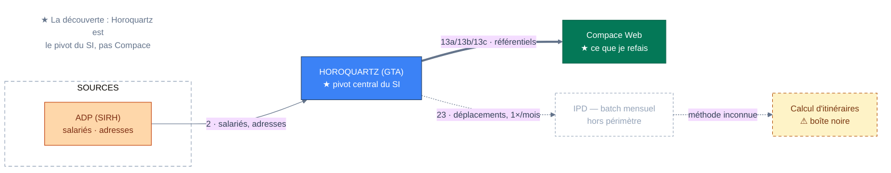

# Mermaid Diagram Creator

Generate ` ```mermaid ` blocks that **argue visually**, not just display information — at a fraction of the token cost of a rendered image. The block lives inside the markdown doc and renders on GitHub, VS Code, and most viewers.

**Diagrams should ARGUE, not DISPLAY.** A diagram makes one point; every node, edge, and color serves that point. The isomorphism test: if you removed all text, would the structure alone still communicate the concept?

---

## Process

1. **State the point.** Write one sentence: what must the reader conclude at a glance? Whatever doesn't serve that sentence stays out of the diagram.
2. **Choose type & direction.** Default `flowchart LR` for systems and flows; `TB` for hierarchies. For sequence, state, or ER diagrams, read `references/other-diagrams.md`.
3. **Build with the style kit** below: zones, a semantic class on every node, edge semantics, annotation nodes.
4. **Verify.** Run the parse check on the doc:
   ```bash
   node ~/.claude/skills/mermaid-diagram/references/validate.mjs <doc.md>
   ```
   It checks every ` ```mermaid ` block (also accepts a raw `.mmd` file). First-time setup on a new machine: `npm install` in `references/`. Done when every block reports `OK`, every item of the pitfall checklist passes, and every node carries a semantic class. If the user wants to see it rendered, any local Mermaid preview works (lavish-axi renders ` ```mermaid ` blocks natively).

---

## Style kit (flowchart)

### Header

First line of the block, before the diagram type:

```
%%{init: {"theme": "base", "themeVariables": {"fontSize": "14px", "lineColor": "#64748b", "primaryTextColor": "#334155"}, "flowchart": {"curve": "basis"}}}%%
```

`curve: basis` gives the soft rounded edges that make the diagram look drawn, not generated.

### Semantic classes — color means, never decorates

Every node gets a class (`node:::pivot`, or `class a,b,c ext`). An unclassed node is a decision not made. Paste this block at the bottom of every diagram and delete the classes you don't use:

```
classDef pivot fill:#3b82f6,stroke:#1e3a5f,color:#ffffff
classDef target fill:#047857,stroke:#065f46,color:#ffffff
classDef ext fill:#ffffff,stroke:#64748b,color:#334155
classDef source fill:#fed7aa,stroke:#c2410c,color:#7c2d12
classDef unknown fill:#fef3c7,stroke:#b45309,color:#78350f,stroke-dasharray:5 4
classDef danger fill:#fecaca,stroke:#b91c1c,color:#7f1d1d
classDef ghost fill:none,stroke:#94a3b8,color:#94a3b8,stroke-dasharray:4 3
classDef note fill:none,stroke:none,color:#64748b
```

| Class | Meaning |
|---|---|
| `pivot` | The center of the argument — the system everything hinges on |
| `target` | What we're building / the thing under discussion |
| `ext` | External or neutral system, context |
| `source` | Origin of data, trigger, input |
| `unknown` | To identify, black box, unverified |
| `danger` | Problem, contested flow, risk |
| `ghost` | Out of scope, deprecated, hors périmètre |
| `note` | Free-floating annotation (see below) |

Repurpose meanings freely, but keep at most 4–5 classes per diagram — each color the reader must decode is a tax on the point.

### Zones (subgraphs)

Group related nodes into labeled regions — dashed, unfilled, so they read as boundaries rather than boxes:

```
subgraph src["SOURCES"]
  direction TB
  adp["ADP (SIRH)"]:::source
end
style src fill:none,stroke:#94a3b8,stroke-dasharray:6 4
```

Zone titles: short and UPPERCASE. Style zones with `style <id>` lines, not classDef (subgraph classDef support is unreliable across renderers).

### Edge semantics

| Syntax | Meaning |
|---|---|
| `==>` | The main flow — the edge the argument rides on. At most one or two per diagram |
| `-->` | Normal flow |
| `-.->` | Manual, uncertain, or degraded (ressaisie, batch, "méthode inconnue") |
| `~~~` | Invisible — layout only, e.g. to position an annotation |

Label edges with what actually moves, and number them when the doc references the flows: `-->|"23 · déplacements, 1×/mois"|`.

To color a specific edge (e.g. red on a contested flow): `linkStyle 3 stroke:#b91c1c` — edges are indexed from 0 in source order; recount after every edge you add or remove.

### Annotations & emphasis

Mermaid has no free-floating text — fake it with a `note` node placed via an invisible edge:

```
finding["★ La découverte : Horoquartz est<br/>le pivot du SI, pas Compace"]:::note
finding ~~~ gta
```

Inside labels: `<br/>` for line breaks (never `\n`), and the glyphs `★ ⚠ ·` for emphasis — they render everywhere; skip HTML tags beyond `<br/>`.

### Size discipline

One argument per diagram, ≤ ~15 nodes. Past that, split: a summary diagram plus one diagram per zone, stacked in the doc with prose between — markdown gives you that for free, and three small arguments beat one mural.

---

## Worked example

Everything assembled — the idiom to imitate:

````

````

---

## Pitfall checklist

The parse check catches syntax; this catches what parses fine yet still fails or misleads on GitHub:

- [ ] **Every label is quoted**: `id["…"]` and `-->|"…"|`, no exceptions — unquoted `(`, `)`, `/`, `:` break the parser
- [ ] **Ids are plain ASCII**, no accents or spaces, and none is a reserved word (`end`, `graph`, `subgraph`, `style`, `class`, `click`, `direction`, `o`, `x`)
- [ ] **Line breaks are `<br/>`**, never `\n`; no HTML beyond `<br/>`
- [ ] **`%%{init}%%` is the first line** of the block, before the diagram type
- [ ] **Every node carries a class**; `classDef`/`style`/`linkStyle` lines sit at the bottom
- [ ] **`linkStyle` indexes recounted** after any edge was added, removed, or reordered
- [ ] **Arrows come from the kit only** (`==>`, `-->`, `-.->`, `~~~`)
