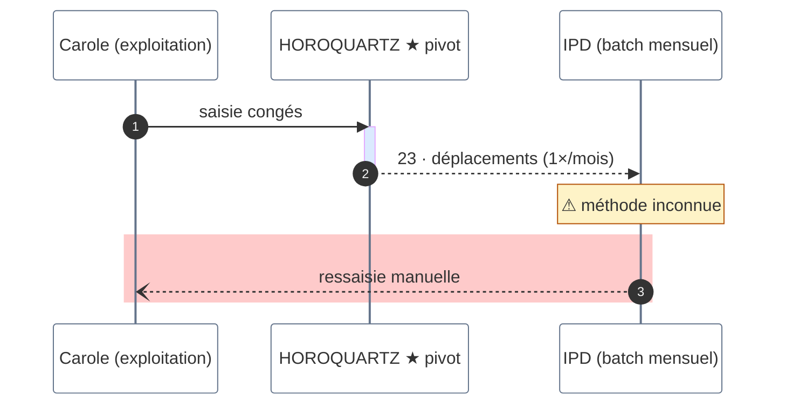
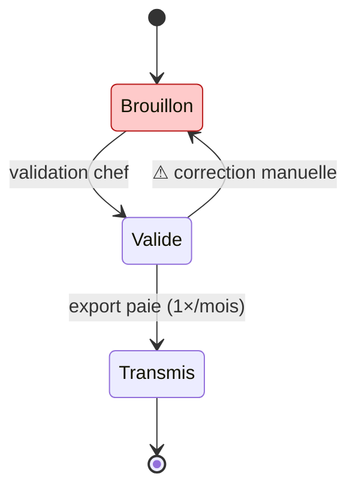
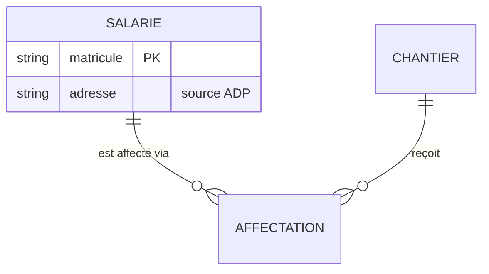

# Other diagram types

Same philosophy as flowcharts — one point per diagram, color means, quote everything — carried into the types where the flowchart style kit doesn't apply. The palette hex values are the same as in `SKILL.md`.

## Sequence diagrams

Use for: protocols, request/response choreography, "who talks to whom in what order".

The vocabulary that carries meaning:

- `autonumber` — free numbering of every message; use it whenever the doc references the flows
- `->>` solid = normal call · `-->>` dashed = response or degraded/manual flow · `--)` async
- `activate`/`deactivate` (or `+`/`-` suffixes) — show who holds the work
- `Note over X` / `Note right of X` — real free-floating annotations (unlike flowcharts)
- `rect rgb(...)` — a background band to flag a contested or dangerous region (use the `danger` fill `rgb(254, 202, 202)`)
- Emphasis in participant names with `★ ⚠`, since classDef doesn't apply here

## State diagrams

Use for: lifecycles, statuses of a record, workflow states.

- `stateDiagram-v2` (never v1); `[*]` for start/end
- Transition labels state the *trigger*, not a description of the target state
- `classDef` + `class X y` works here — same palette, applied to states
- Composite states (`state X { ... }`) play the role of zones

## Entity-relationship diagrams

Use for: data models, "what references what".

- Cardinality glyphs are the argument: `||` exactly one, `o{` zero-or-many, `|{` one-or-many
- Keep attribute lists to what the point needs — PK/FK and the 2–3 columns under discussion, with a trailing `"comment"` for provenance or doubt
- No classDef here; emphasis lives in relationship labels and attribute comments

## Pitfalls specific to these types

- Sequence: participant aliases (`participant C as ...`) keep ids ASCII while labels stay rich; `end` closes `rect`/`alt`/`loop` blocks — indent consistently or blocks swallow the rest of the diagram
- State: state names are ids — ASCII, no spaces; use `state "label riche" as s1` for accented display names
- ER: entity and attribute names must be bare words (no quotes, no accents); only relationship labels and attribute comments accept quoted strings
